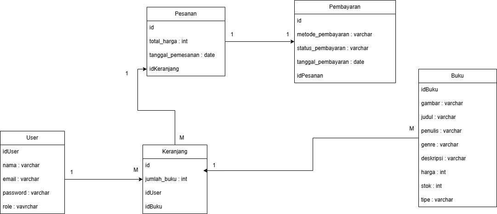
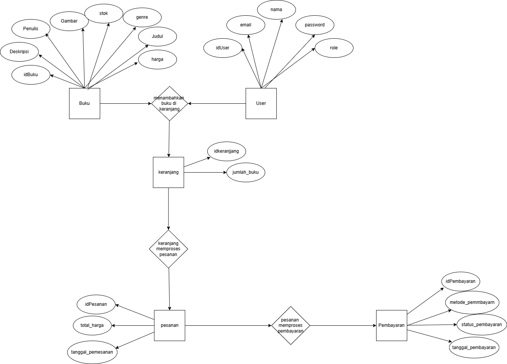
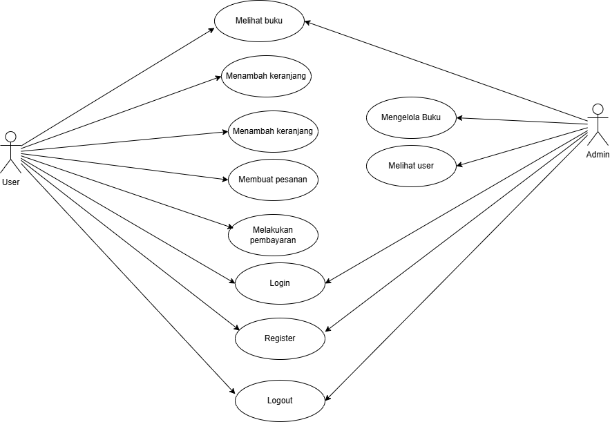
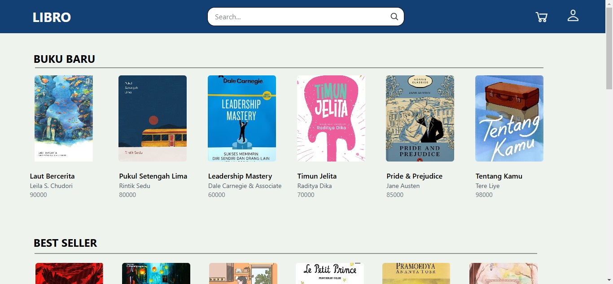
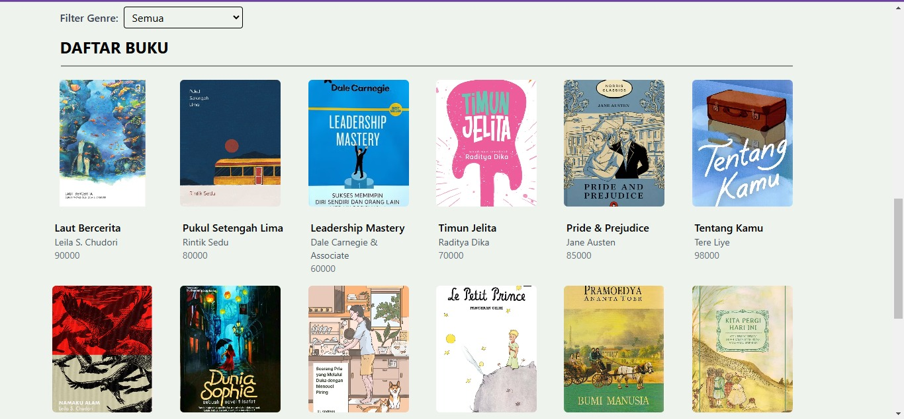
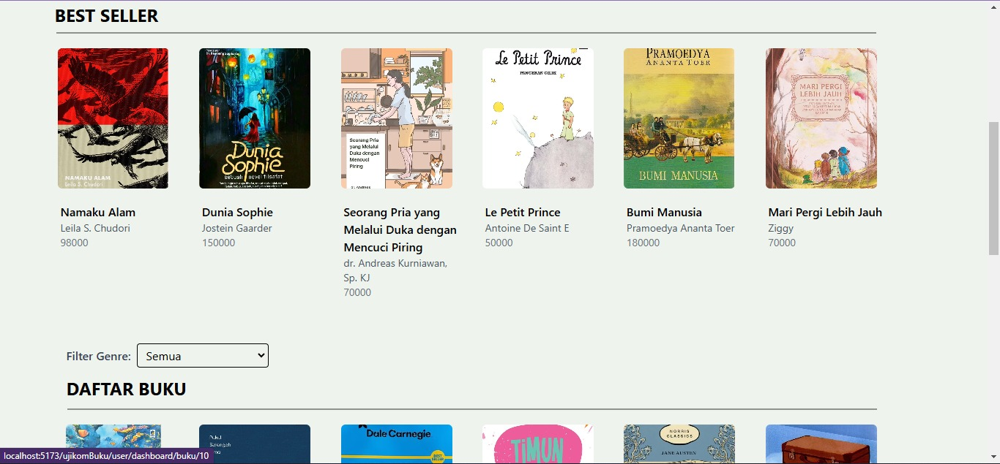

# UML

### Class Diagram

### ERD

### Use Case Diagram

### Tampilan web

## Konsep
merupakan web online shop khusus untuk membeli buku

### Model
- User (customer dan admin)
- Buku
- Keranjang
- Pesanan
- Pembayaran

### Relasi
- 1 customer mempunyai banyak keranjang
- banyak buku mempunyai 1 keranjang
- banyak keranjang mempunyai 1 pesanan
- 1 pesanan mempunyai 1 pembayaran